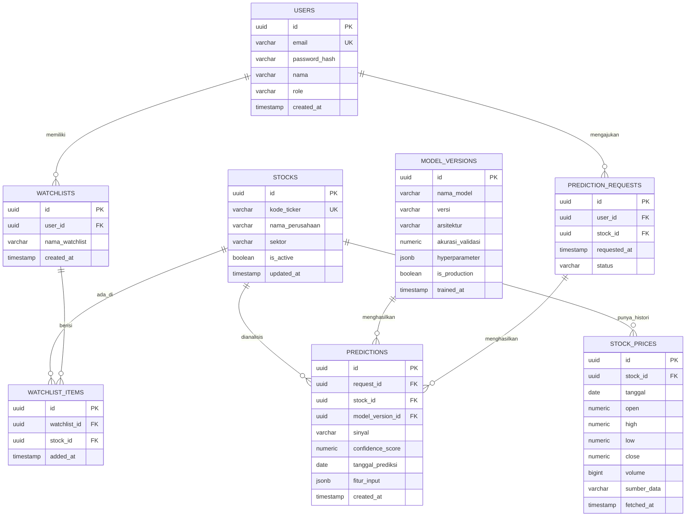
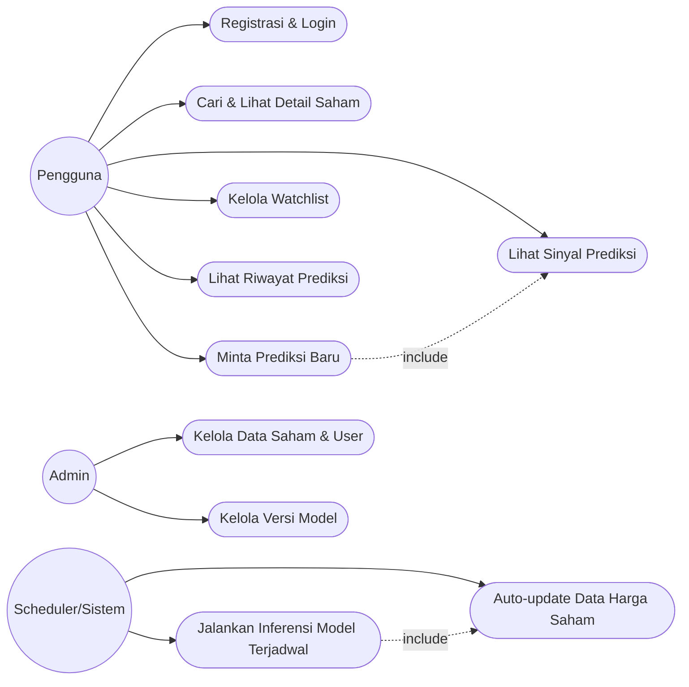

# Perencanaan Sistem: Stock Trading Signal Prediction

Dokumen referensi untuk tahap produksi — tugas akhir sistem prediksi sinyal saham (Buy/Hold/Sell) berbasis web dengan arsitektur ensemble ML/DL.

---

## 1. PDM (Physical Data Model)



Catatan indeks penting: `STOCK_PRICES(stock_id, tanggal)` composite unique, `PREDICTIONS(stock_id, tanggal_prediksi)` untuk query riwayat cepat.

---

## 2. Use Case Diagram

Aktor: **Pengguna (Investor)**, **Admin**, **Scheduler (sistem otomatis)**.



Deskripsi singkat use case kunci:

- **Minta Prediksi Baru**: user memicu request → sistem cek data harga terbaru → jika belum ada, trigger fetch → jalankan model aktif → simpan hasil ke `predictions`.
- **Auto-update Data Harga Saham**: job terjadwal (cron/scheduler) menarik data harga harian dari sumber eksternal, insert ke `stock_prices`.
- **Kelola Versi Model**: admin bisa menandai satu `model_version` sebagai `is_production = true`.

---

## 3. Rencana Pengembangan

| Fase | Durasi Estimasi | Output |
| --- | --- | --- |
| 1. Riset & Requirement | 2 minggu | Studi literatur ensemble model, daftar fitur teknikal (RSI, MACD, MA, dll), scope final |
| 2. Desain Sistem | 1–2 minggu | PDM final, use case, arsitektur (ini + prompt) |
| 3. Data Pipeline | 2 minggu | Script fetch & cleaning data historis, job auto-update |
| 4. Model Development | 3–4 minggu | Ensemble (mis. LSTM + XGBoost + attention), evaluasi backtest |
| 5. Backend API | 2 minggu | REST/GraphQL API, auth, endpoint prediksi & riwayat |
| 6. Frontend | 2–3 minggu | Dashboard, watchlist, grafik sinyal |
| 7. Integrasi & Testing | 1–2 minggu | End-to-end test, validasi akurasi live |
| 8. Deployment & Monitoring | 1 minggu | CI/CD, monitoring model drift |

---

## 4. Prompt untuk AI (Referensi Tahap Produksi)

Salin prompt ini ke AI coding assistant (Claude Code, Cursor, dll) saat mulai coding:

```
Saya sedang membangun sistem web prediksi sinyal trading saham (Buy/Hold/Sell) sebagai tugas akhir.

KONTEKS PROYEK:
- Arsitektur ML: ensemble ML/DL (gabungan minimal 2 model, misal LSTM untuk pola time-series dan
  XGBoost/Random Forest untuk fitur teknikal, digabung via voting/stacking)
- Data: harga saham historis (OHLCV) yang di-update otomatis secara berkala
- Output prediksi: sinyal Buy/Hold/Sell + confidence score, disimpan sebagai riwayat

STACK YANG DIGUNAKAN:
- Backend: [isi: Python FastAPI / Node.js Express]
- Frontend: [isi: React/Next.js]
- Database: PostgreSQL (+ TimescaleDB untuk data time-series) — lihat skema PDM terlampir
- ML Serving: [isi: FastAPI endpoint terpisah / model di-load langsung di backend]
- Scheduler: [isi: APScheduler / Celery beat / cron]

TUGAS SPESIFIK SAAT INI:
[isi bagian ini per sesi, contoh:]
"Buatkan endpoint POST /predictions yang menerima stock_id, mengambil 60 hari data harga
terakhir dari tabel stock_prices, menghitung fitur teknikal (RSI-14, MACD, MA-20, MA-50),
menjalankan model ensemble versi aktif (model_versions.is_production = true), lalu
menyimpan hasil ke tabel predictions dan mengembalikan sinyal + confidence score."

ATURAN PENTING:
- Ikuti skema PDM yang sudah ditentukan, jangan mengubah struktur tabel tanpa konfirmasi
- Setiap fungsi fetch data eksternal harus punya retry & error handling (API saham sering rate-limit)
- Pisahkan logic model (training/inference) dari logic API — jangan campur
- Tulis kode yang bisa di-test, sertakan contoh unit test untuk fungsi kritikal (perhitungan fitur, parsing sinyal)
- Jangan hardcode kredensial API, gunakan environment variable
```

---

## 5. Prompt untuk Desain UI (Anti-AI-Slop, Human-Made Feel)

Prompt ini menghindari pola generic AI (hero+card template, gradient default, icon sparkle/lightning, badge "AI Powered", dsb) dan memaksa keputusan desain yang punya alasan tertulis.

```
Rancang antarmuka web dashboard prediksi sinyal saham. Ini BUKAN landing page marketing —
ini adalah tool kerja harian untuk investor retail yang butuh baca data cepat dan akurat.

PRINSIP DESAIN (wajib dipatuhi):
1. Data-first, bukan decoration-first. Grafik harga & sinyal adalah fokus utama tiap layar —
   bukan hero section besar dengan headline marketing.
2. Palet warna: maksimal 2-3 warna inti + 1 aksen. Gunakan warna sinyal yang punya makna
   jelas dan konsisten (contoh: hijau = Buy, merah = Sell, abu/kuning = Hold) — bukan
   sekadar dekorasi, harus fungsional dan konsisten di semua komponen.
3. Tipografi: pilih font dengan alasan (keterbacaan angka/data, bukan monospace besar
   untuk gaya "teknis" semata). Angka (harga, persentase) harus pakai tabular figures.
4. DILARANG: gradient/glow tanpa alasan hierarki, icon generic (sparkle, lightning, robot),
   badge "AI Powered"/"Beta" tanpa fungsi nyata, card fitur yang semuanya identik ukuran-
   nya, animasi template (fade-up + float + scale bersamaan), ilustrasi generic (undraw-style).
5. Setiap statistik atau angka yang ditampilkan harus berasal dari data asli (harga, akurasi
   model, timestamp update terakhir) — tidak boleh ada angka fiktif seperti "99.9% akurat".
6. Layout harus responsif penuh: tabel/grafik data harus scroll horizontal di mobile,
   bukan overflow atau pecah. Tap target tombol minimal 44x44px di mobile.
7. Sertakan state kosong (belum ada watchlist), state loading (saat fetch prediksi), dan
   state error (saat API saham gagal/rate-limit) — bukan cuma tampilan "happy path".
8. Kontras teks minimal WCAG AA (4.5:1 teks normal, 3:1 teks besar). Semua elemen interaktif
   bisa dinavigasi keyboard dengan focus state yang terlihat.
9. Setiap tombol/CTA harus jelas fungsinya (bukan "Get Started"/"Explore" generic) — gunakan
   label spesifik seperti "Tambah ke Watchlist", "Lihat Riwayat Prediksi".

HALAMAN YANG DIBUTUHKAN:
- Dashboard utama: ringkasan watchlist + sinyal terbaru
- Detail saham: grafik harga historis + overlay sinyal + confidence score + riwayat prediksi
- Halaman watchlist: kelola daftar saham yang dipantau
- Halaman riwayat prediksi: tabel filterable by tanggal/saham/sinyal

Sebelum submit hasil desain, jalankan self-check: apakah desain ini masih terlihat generic
kalau logo/nama produk diganti? Kalau ya, revisi dulu.
```

---

## 6. Library untuk Auto-Update Data Saham

Karena tugas akhir kemungkinan fokus saham Indonesia (IDX), berikut opsi:

| Library/API | Catatan |
| --- | --- |
| **yfinance** (Python) | Gratis, mudah, cukup lengkap untuk data global termasuk beberapa ticker `.JK` (IDX) via Yahoo Finance — tapi unofficial, kadang rate-limited/berubah tanpa notice |
| **Alpha Vantage API** | Free tier terbatas (5 req/menit), cocok untuk data internasional, kurang lengkap untuk IDX |
| **Sectors App API / RTI Business API** | Layanan lokal Indonesia berbayar, data IDX lebih akurat & real-time — pertimbangkan jika butuh reliabilitas tinggi |
| **pandas-datareader** | Wrapper untuk beberapa sumber data, kompatibel dengan pipeline pandas |

Untuk scheduling auto-update:

- **APScheduler** (Python) — ringan, cocok jika backend Python (FastAPI/Django)
- **Celery Beat** — jika sudah pakai Celery untuk task async lain
- **cron job** biasa (Linux) yang memanggil script fetch — paling sederhana untuk MVP

Rekomendasi MVP: mulai dengan **yfinance + APScheduler** (gratis, cepat setup), lalu evaluasi migrasi ke API berbayar lokal kalau butuh akurasi data IDX yang lebih baik untuk laporan tugas akhir.

---

## 7. Saran Database untuk Riwayat Prediksi & Data Harga

**Rekomendasi utama: PostgreSQL + ekstensi TimescaleDB**

- Data harga saham (`stock_prices`) dan riwayat prediksi (`predictions`) sifatnya time-series (append-heavy, query by date range) — TimescaleDB memberi performa query time-series jauh lebih baik daripada PostgreSQL biasa, sambil tetap relational (cocok untuk relasi user/watchlist/model).
- Alternatif kalau tidak mau install ekstensi: PostgreSQL biasa dengan partisi tabel per bulan/tahun untuk `stock_prices`.

**Alternatif lain (kalau volume data sangat besar / real-time tick data):**

- **InfluxDB** — database time-series murni, sangat cepat untuk write-heavy data harga, tapi butuh database terpisah untuk data relational (user, watchlist) → kompleksitas tambahan, biasanya berlebihan untuk tugas akhir.

**Tambahan:**

- **Redis** sebagai cache untuk data harga yang sering diakses (misal harga hari ini) dan hasil prediksi terbaru — mengurangi beban query berulang ke database utama.

Untuk skala tugas akhir, **PostgreSQL + TimescaleDB saja sudah cukup** tanpa perlu multi-database — lebih sederhana untuk dijelaskan di laporan dan di-maintain sendiri.