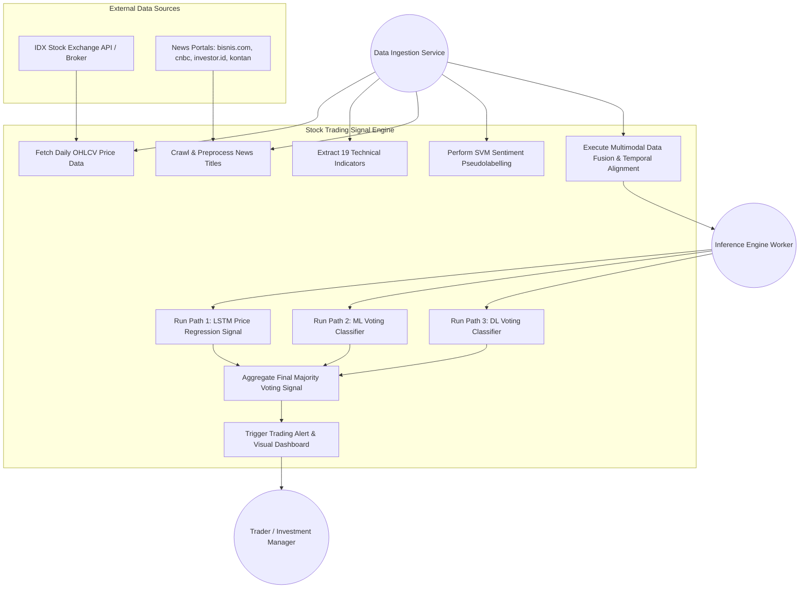

Berikut adalah cetak biru teknis lengkap untuk tahap produksi sistem **Hybrid Multimodal Stock Trading Signal Prediction**, yang mencakup **Physical Data Model (PDM)**, **Use Case Diagram**, **Rencana Implementasi Produksi**, serta **Master Prompt AI** yang siap dikirimkan ke AI developer/code generator.

---

### 1. Physical Data Model (PDM)

PDM dirancang untuk menangani *ingestion* data transaksi harian, ekstraksi indikator teknikal, *crawling* berita, analisis sentimen, *data fusion* tanpa *lookahead bias*, serta penyimpanan hasil inferensi ensemble.

```sql
-- 1. Master Tabel Saham (LQ45 Blue-Chip)
CREATE TABLE dim_stocks (
    symbol VARCHAR(10) PRIMARY KEY, -- Contoh: 'ADRO', 'TLKM', 'BMRI'
    company_name VARCHAR(100) NOT NULL,
    sector VARCHAR(50) NOT NULL,
    is_active BOOLEAN DEFAULT TRUE,
    created_at TIMESTAMP DEFAULT CURRENT_TIMESTAMP
);

-- 2. Data Transaksi Harga Historis (OHLCV)
CREATE TABLE fact_stock_prices (
    id BIGSERIAL PRIMARY KEY,
    symbol VARCHAR(10) REFERENCES dim_stocks(symbol),
    datetime DATE NOT NULL,
    open NUMERIC(12, 2) NOT NULL,
    high NUMERIC(12, 2) NOT NULL,
    low NUMERIC(12, 2) NOT NULL,
    close NUMERIC(12, 2) NOT NULL,
    volume BIGINT NOT NULL,
    CONSTRAINT unique_stock_date UNIQUE (symbol, datetime)
);

-- 3. Indikator Teknikal (19 Fitur Predictor)
CREATE TABLE fact_technical_indicators (
    id BIGSERIAL PRIMARY KEY,
    symbol VARCHAR(10) REFERENCES dim_stocks(symbol),
    datetime DATE NOT NULL,
    sma_5 NUMERIC(12, 4),
    sma_10 NUMERIC(12, 4),
    sma_20 NUMERIC(12, 4),
    sma_50 NUMERIC(12, 4), -- Moving Averages
    ema_5 NUMERIC(12, 4),
    ema_10 NUMERIC(12, 4),
    ema_20 NUMERIC(12, 4),
    ema_50 NUMERIC(12, 4), -- Exponential Moving Averages
    rsi NUMERIC(8, 4),     -- Relative Strength Index 14 hari
    macd NUMERIC(12, 4),   -- MACD 12 & 26 hari
    macd_signal NUMERIC(12, 4), -- MACD Signal 9 hari
    upperband NUMERIC(12, 4),   -- Bollinger Bands Upper (20 hari, 2 STD)
    middleband NUMERIC(12, 4),  -- Bollinger Bands Middle
    lowerband NUMERIC(12, 4),   -- Bollinger Bands Lower
    CONSTRAINT unique_tech_stock_date UNIQUE (symbol, datetime)
);

-- 4. Mentah Berita Saham (Hasil Web Crawling)
CREATE TABLE fact_news_raw (
    id BIGSERIAL PRIMARY KEY,
    symbol VARCHAR(10) REFERENCES dim_stocks(symbol),
    portal_source VARCHAR(50) NOT NULL, -- bisnis.com, cnbcindonesia.com, investor.id, kontan.co.id
    title TEXT NOT NULL,
    published_at TIMESTAMP NOT NULL,
    aggregated_trading_date DATE NOT NULL, -- Penyesuaian aturan cut-off jam 16:00 & hari libur
    created_at TIMESTAMP DEFAULT CURRENT_TIMESTAMP
);

-- 5. Hasil Sentimen Berita (SVM Pseudolabelling & Lexicon)
CREATE TABLE fact_news_sentiment (
    id BIGSERIAL PRIMARY KEY,
    symbol VARCHAR(10) REFERENCES dim_stocks(symbol),
    datetime DATE NOT NULL, -- Trading date teragregasi
    negative_count INT DEFAULT 0,
    positive_count INT DEFAULT 0,
    neutral_count INT DEFAULT 0,
    total_news INT DEFAULT 0,
    sentiment_flag INT NOT NULL, -- -1: Negative, 0: No Sentiment, 1: Mix, 2: Positive
    CONSTRAINT unique_sentiment_stock_date UNIQUE (symbol, datetime)
);

-- 6. Dataset Fused Multimodal (Siap Input Model Engine)
CREATE TABLE fact_fused_market_data (
    id BIGSERIAL PRIMARY KEY,
    symbol VARCHAR(10) REFERENCES dim_stocks(symbol),
    datetime DATE NOT NULL,
    -- 19 Fitur gabungan lengkap + label ground truth target
    fused_features_json JSONB NOT NULL, 
    ground_truth_signal INT, -- 0: Sell, 1: Hold, 2: Buy
    CONSTRAINT unique_fused_stock_date UNIQUE (symbol, datetime)
);

-- 7. Hasil Prediksi Tiga Jalur & Ensemble Final
CREATE TABLE fact_ensemble_predictions (
    id BIGSERIAL PRIMARY KEY,
    symbol VARCHAR(10) REFERENCES dim_stocks(symbol),
    datetime DATE NOT NULL,
    target_horizon_days INT DEFAULT 50, -- Target horizon optimal 50 hari
    price_reg_predicted_price NUMERIC(12, 2), -- Output regresi LSTM
    price_reg_signal INT NOT NULL,           -- Signal (+1, 0, -1) dari regresi harga
    ml_voting_signal INT NOT NULL,          -- Signal dari Voting ML (RF, AdaBoost, XGB, SVM, KNN)
    dl_voting_signal INT NOT NULL,          -- Signal dari Voting DL (LSTM, BiLSTM, GRU, BiGRU)
    final_ensemble_signal INT NOT NULL,     -- Hasil Majority Voting (0: Sell, 1: Hold, 2: Buy)
    created_at TIMESTAMP DEFAULT CURRENT_TIMESTAMP,
    CONSTRAINT unique_pred_stock_date UNIQUE (symbol, datetime)
);

-- Indexes untuk Kecepatan Query Pipeline
CREATE INDEX idx_prices_symbol_date ON fact_stock_prices(symbol, datetime DESC);
CREATE INDEX idx_sentiment_symbol_date ON fact_news_sentiment(symbol, datetime DESC);
CREATE INDEX idx_predictions_symbol_date ON fact_ensemble_predictions(symbol, datetime DESC);
```

---

### 2. Use Case Diagram

#### Diagram Syntax (Mermaid)



#### Deskripsi Aktor & Use Case Utama
1. **Data Ingestion Service**: Layanan terjadwal yang mengambil data transaksi harian (OHLCV) dan melakukan *scraping* berita keuangan secara berjangka dari portal nasional.
2. **Preprocessing & Fusion Pipeline**: 
   - Mengalkulasi indikator teknikal (SMA, EMA, RSI, MACD, Bollinger Bands).
   - Menjalankan pembersihan teks berita (*case folding*, tokenisasi, *stopword removal*, *stemming*), dilanjutkan *vectorization* (CountVectorizer, max 5,000 fitur, n-gram 1-2) dan klasifikasi sentimen.
   - Melakukan *outer merge* berdasarkan tanggal, menerapkan aturan agregasi berita akhir pekan/hari libur, serta *cut-off* jam **16:00 WIB** untuk berita pasca-penutupan pasar agar mencegah *lookahead bias*.
3. **Inference Engine Worker**:
   - **Path 1 (Price Regression)**: Memprediksi harga penutupan hari ke-\\(t+50\\) menggunakan LSTM, lalu mengubahnya menjadi sinyal Buy/Sell/Hold berbasis ambang batas persentase \\(k = 11.0\%\\).
   - **Path 2 (ML Voting)**: Klasifikasi menggunakan kombinasi model klasik (Random Forest, AdaBoost, XGBoost, SVM, KNN).
   - **Path 3 (DL Voting)**: Klasifikasi *hard voting* dari model deep learning (LSTM, Bi-LSTM, GRU, Bi-GRU).
   - **Final Ensemble**: Memproses ketiga sinyal melalui mekanisme *Majority Voting* untuk menentukan keputusan final (0: Sell, 1: Hold, 2: Buy).
4. **Trader / User**: Menerima sinyal transaksi final bersama visualisasi tingkat kepercayaan dan rekomendasi horizon 50 hari.

---

### 3. Production Implementation Plan

#### Tahap 1: Data Pipeline & ETL Architecture (Minggu 1–2)
* **Ingestion Scheduler**: Bangun pipeline berbasis Airflow/Prefect untuk menarik data OHLCV pasar harian setelah jam tutup bursa (16:00 WIB).
* **News Scraper Module**: Integrasikan scraper otomatis untuk 4 portal berita (bisnis.com, cnbcindonesia.com, investor.id, investasi.kontan.co.id).
* **Text Preprocessing & Pseudolabeling**: Implementasikan pipeline klasifikasi sentimen berbasis Lexicon + SVM Pseudolabeling dengan ambang *confidence* bertingkat (95% hingga 80%).
* **Fusion Logic**: Terapkan logika *outer merge* tanggal dengan penggeseran berita pasca 16:00 WIB dan agregasi hari libur ke hari perdagangan berikutnya.

#### Tahap 2: Model Training & Evaluation Pipeline (Minggu 3–4)
* **Sliding Window Generator**: Siapkan generator time-series dengan *sliding window* 50 hari sesuai konfigurasi *target horizon* optimal.
* **Hyperparameter Standardization**: 
  * **DL Models (RNN, LSTM, GRU, Bi-LSTM, Bi-GRU)**: Set 3 *layers*, 96 *units* per layer, *dropout* 0.20, *batch size* 32, 50 *epochs*, dengan *Early Stopping* (patience 10).
  * **ML Models**: Set GridSearch CV (Random Forest n_estimators=100, XGBoost lr=0.1 max_depth=6, SVM RBF kernel, KNN k=5, AdaBoost lr=1.0).
* **Validation Protocols**: Gunakan pembagian data kronologis tanpa *shuffling* (80% Train, 20% Test) dan evaluasi berkala dengan *5-fold Walk-Forward Validation* untuk mencegah *concept drift*.

#### Tahap 3: Inference Service & API Deployment (Minggu 5–6)
* **Microservices Architecture**: Bungkus pipeline inferensi ke dalam REST API (FastAPI) yang terisolasi dalam container Docker.
* **3-Path Voting Engine Execution**: Buat modul *worker* paralel untuk mengeksekusi Path 1 (LSTM Regression), Path 2 (ML Voter), dan Path 3 (DL Voter), lalu lakukan konsolidasi *Majority Voting*.
* **Alerting & Notification**: Integrasikan pembuat sinyal visual (Hijau: Buy, Merah: Sell, Hitam/Abu-abu: Hold) ke sistem notifikasi (Telegram/Email/Dashboard).

#### Tahap 4: Monitoring, Retraining & Governance (Berkelanjutan)
* **Model Drift Monitoring**: Pantau *F1-score* dan ketepatan sinyal harian. Jika performa out-of-sample turun di bawah 85%, pemicu re-training otomatis berbasis *Walk-Forward expanding window* akan dijalankan.
* **Zero Fatal Misclassification Guardrail**: Pastikan logika prapencetakan sinyal memiliki validasi agar tidak ada transaksi balikan ekstrem (Buy langsung ke Sell atau sebaliknya tanpa jeda analisis risiko).

---

### 4. Master Prompt untuk AI Developer (Referensi Production)

Copy dan kirimkan prompt di bawah ini ke AI Code Generator (seperti Cursor, Claude, atau GPT-4) sebagai pedoman teknis pengembangan sistem:

```text
HEREDOC_START
Kamu adalah Senior Financial Technology & Software Architect. Tugasmu adalah mengimplementasikan kode sistem produksi berbasis Python untuk "Hybrid Multimodal Stock Trading Signal Prediction Engine" berdasarkan arsitektur riset resmi.

### SPESIFIKASI TEKNIS & PERSYARATAN ARSITEKTUR:

1. MODUL DATA PIPELINE & FEATURE ENGINEERING:
   - Ambil data transaksi OHLCV dan ekstrak 19 indikator teknikal: SMA (5,10,20,50), EMA (5,10,20,50), RSI (14 hari), MACD (12,26) & Signal (9), serta Bollinger Bands (20 hari, 2 STD) menggunakan TA-Lib / pandas.
   - Ambil data judul berita, lakukan preprocessing teks (case folding, cleaning, tokenization, stopword removal, stemming).
   - Jalankan vaktorisasi teks menggunakan CountVectorizer (max_features=5000, ngram_range=(1,2)).
   - Implementasikan klasifikasi sentimen SVM dengan skema Pseudolabelling (iterasi confidence threshold dari 95% turun ke 80%).
   - Encode flag sentimen menjadi: -1 (Negative), 0 (No Sentiment/Neutral), 1 (Mix), 2 (Positive).

2. TEMPORAL DATA FUSION (MENCEGAH LOOKAHEAD BIAS):
   - Gabungkan data transaksi dan sentimen berita menggunakan Outer Merge berdasarkan tanggal (datetime).
   - Terapkan Aturan Agregasi Berita Pasca Penutupan: Berita yang terbit setelah pukul 16:00 WIB (atau pada hari libur bursa) WAJIB diakumulasikan dan dialokasikan ke hari perdagangan (trading day) berikutnya.

3. STRUCTURE INFERENCE ENGINE (3-PATH HYBRID ENSEMBLE):
   - Tentukan Sliding Window sebesar 50 hari untuk memprediksi Target Horizon 50 hari.
   - Path 1 (Price Regression): Model LSTM (3 layer x 96 units, dropout 0.20) memprediksi harga closing t+50. Konversikan harga prediksi menjadi sinyal:
     * +1 (Buy) jika (Predicted_Price - Actual_Price) / Actual_Price > 0.11 (11%)
     * -1 (Sell) jika (Predicted_Price - Actual_Price) / Actual_Price < -0.11 (-11%)
     *  0 (Hold) jika di antara threshold -11% s.d +11%.
   - Path 2 (Machine Learning Voting Classifier): Hard Voting dari 5 model ML (Random Forest, AdaBoost, XGBoost, SVM, KNN) yang dilatih menggunakan 19 fitur fused.
   - Path 3 (Deep Learning Voting Classifier): Hard Voting dari 4 model DL (LSTM, Bi-LSTM, GRU, Bi-GRU) dengan konfigurasi 3 layer x 96 units, dropout 0.20 yang dilatih menggunakan 19 fitur fused.
   - Ensemble Final: Gunakan Majority Voting dari ketiga Path di atas untuk menghasilkan sinyal transaksi akhir: 0 (Sell), 1 (Hold), 2 (Buy).

4. PERSYARATAN KODE & KUALITAS PRODUKSI:
   - Tulis kode modular dengan Type Hinting, Docstrings, dan penanganan Exception yang lengkap.
   - Gunakan PyTorch / TensorFlow Keras untuk Deep Learning dan Scikit-Learn / XGBoost untuk Machine Learning.
   - Sertakan skrip evaluasi Walk-Forward Validation (5-Fold expanding window) untuk memastikan tidak ada data leakage.
   - Sediakan skema database SQLAlchemy yang sesuai dengan tabel PDM (dim_stocks, fact_stock_prices, fact_technical_indicators, fact_news_sentiment, fact_ensemble_predictions).

Tolong hasilkan struktur proyek modular (ETL pipeline, model modules, inference engine, dan API service FastAPI) secara lengkap dan siap pakai.
HEREDOC_END
```

---

 scalable dan traceable sesuai metodologi *multimodal data fusion*.

Terima kasih! Sekarang mari kita lanjutkan ke tahap desain antarmuka (**UI/UX Web Dashboard**) dan arsitektur data produksi untuk platform **Hybrid Stock Signal Prediction** berbasis multimodal ensemble learning.

Berikut adalah panduan lengkap yang mencakup **Master Prompt UI/UX**, **Rekomendasi Library & API Data Saham**, serta **Arsitektur Database untuk History Prediksi**.

---

### 1. Master Prompt UI/UX Design (Anti-AI Slop & Human-Like SaaS Style)

Prompt ini dirancang untuk dikirim ke AI Generator/UI Builder (seperti **v0.dev**, **Bolt.new**, **Claude**, atau **Figma AI**) untuk menghasilkan tampilan dashboard finansial kelas *institutional trading* (berkonsep ala *TradingView meets minimalis Linear/Vercel*), padat informasi, bersih, dan menghindari estetika AI generik (*neon glow* berlebihan atau elemen 3D futuristik yang tidak fungsional).

```text
HEREDOC_START
Design a modern, high-density professional B2B/B2C Quantitative Trading Dashboard for a "Multimodal Hybrid Stock Signal Detection Engine" focused on Indonesian Blue-Chip stocks (IDX LQ45). 

DESIGN SYSTEM & AESTHETICS (Human-Made, Clean SaaS Style):
- Style Inspiration: Linear.app, Vercel Dashboard, TradingView, and Bloomberg Terminal (clean data density).
- Color Palette: Dark mode default (Slate/Zinc #09090B background, #18181B card borders).
- Accent Colors: Clean financial indicators with strict contrast.
  * BUY Signal: Emerald Green (#10B981)
  * SELL Signal: Rose/Crimson Red (#F43F5E)
  * HOLD Signal: Muted Zinc/Gray (#71717A)
- Typography: Inter or SF Pro Display, tight tracking, monospace fonts for financial metrics and price numbers (e.g., JetBrains Mono).
- NO AI SLOP: Absolutely NO exaggerated glowing neon effects, NO meaningless 3D floating icons, NO generic sci-fi futuristic rings. Keep it clean, functional, structured, and human-crafted.

KEY DASHBOARD LAYOUT & COMPONENTS:

1. Top Navigation & Ticker Bar:
   - Live ticker tape showing top LQ45 tickers (ADRO, TLKM, BMRI, ANTM, EXCL) with daily % change and sentiment indicator badge.
   - Search bar with quick ticker lookup, date range filter (Default: 50-Day Horizon Target), and System Status indicator ("Pipeline Status: Synced at 16:00 WIB").

2. Hero Signal Overview Card (Main Active Stock):
   - Current Stock Symbol (e.g., "ADRO.JK - Adaro Energy Indonesia").
   - Final Ensemble Signal Badge: Bold "BUY" / "SELL" / "HOLD" tag with confidence score and Majority Voting breakdown (e.g., "3/3 Path Consensus").
   - Key Metrics Grid: Latest Close Price, 50-Day Horizon Target Price, MACD Signal, RSI (14), Sentiment Score (Positive/Negative/Neutral count).

3. Technical Chart & Signal Visualization Widget:
   - Interactive Candlestick Chart (OHLCV) powered by TradingView-style canvas.
   - Overlays: SMA (5, 10, 20, 50), EMA, and Bollinger Bands (20, 2 STD).
   - Signal Markers: Clean Green upward triangles for Buy signals and Red downward triangles for Sell signals anchored directly above/below candles on specific trading dates.
   - Sub-chart panel: MACD histogram and News Sentiment Volume distribution.

4. 3-Path Model Voting Consensus Panel (Transparent Inference Breakdown):
   - Path 1 Card: LSTM Price Regression (Predicted vs Actual target price with % gap).
   - Path 2 Card: Machine Learning Voter (Confidence breakdown from Random Forest, XGBoost, SVM, KNN, AdaBoost).
   - Path 3 Card: Deep Learning Voter (Consensus vote from LSTM, Bi-LSTM, GRU, Bi-GRU).
   - Final Decision Gate: Visual logic flow showing how Majority Voting combined the 3 paths into the final trading signal.

5. Multimodal Sentiment Feed (Live News Stream):
   - Real-time aggregated news titles from national portals (Bisnis.com, CNBC Indonesia, Investor.id, Kontan).
   - News item row: Source logo, Title, Publishing Date/Time, Adjusted Trading Date tag (reflecting the 16:00 WIB cut-off rule), and SVM Pseudolabeling tag (-1, 0, +1, +2).

6. Prediction History & Backtest Metrics Table:
   - Data table displaying historical signal logs with columns: Date, Ticker, Predicted Signal, Actual Price Action at Day t+50, Accuracy Outcome, F1 Score Impact, and Execution Status.
   - Minimalist pagination, CSV export button, and search/filter by ticker and date range.

Output modern, fully responsive React + Tailwind CSS code using Lucide-react icons and Shadcn UI components.
HEREDOC_END
```

---

### 2. Library & API untuk Auto-Update Data Saham (Bursa Indonesia / IDX)

Untuk mengotomatisasi pembaruan data transaksi harian (OHLCV) dan indikator teknikal, berikut adalah pustaka dan API yang dapat digunakan:

#### A. Library Python & API Data Saham
1. **`yfinance` (Open Source & Gratis)**
   * **Penggunaan**: Sangat handal untuk mengambil data historis dan harian bursa Indonesia (menggunakan akhiran ticker `.JK`, misalnya `ADRO.JK`, `TLKM.JK`, `BMRI.JK`).
   * **Keunggulan**: Bebas biaya, tidak memerlukan API Key, dan mudah diintegrasikan dengan `pandas` serta `TA-Lib`.
   ```python
   import yfinance as yf

   # Mengambil data OHLCV harian ADRO
   stock_data = yf.download("ADRO.JK", period="1d", interval="1d")
   ```
2. **GoAPI / Sectors API (Data Spesifik IDX / Saham Indonesia)**
   * **Penggunaan**: API komersial lokal yang menyediakan data *real-time* bursa Indonesia, data fundamental, serta *corporate actions* secara langsung dari IDX.
   * **Keunggulan**: Bebas dari risiko *rate limit* atau *blocking* bursa lokal.
3. **`TA-Lib` (Technical Analysis Library)**
   * **Penggunaan**: Menghitung 19 indikator teknikal (SMA, EMA, RSI, MACD, Bollinger Bands) secara otomatis.
   ```python
   import talib

   df["sma_50"] = talib.SMA(df["Close"], timeperiod=50)
   df["rsi"] = talib.RSI(df["Close"], timeperiod=14)
   df["macd"], df["macd_signal"], _ = talib.MACD(
       df["Close"], fastperiod=12, slowperiod=26, signalperiod=9
   )
   ```

#### B. Ingestion & Orchestration Scheduler
Untuk memastikan data diperbarui secara otomatis tanpa intervensi manual:
* **APScheduler / Celery + Redis**: Untuk mengeksekusi skrip *fetching* data saham dan *crawling* berita tepat pada pukul **16:15 WIB** (setelah pasar reguler IDX tutup).
* **Prefect / Apache Airflow**: Untuk mengatur dependensi pipeline dari *data fetching* \\(\rightarrow\\) *feature extraction* \\(\rightarrow\\) *sentiment analysis* \\(\rightarrow\\) *model inference*.

---

### 3. Rekomendasi Database untuk History Prediksi

Penyimpanan data riwayat prediksi finansial memerlukan database yang efisien dalam menangani query **time-series** (berbasis stempel waktu) serta query relasional (informasi emiten, log *voting*, dan performa model).

#### Rekomendasi Utama: **PostgreSQL + TimescaleDB Extension**

* **Alasan Pemilihan**:
  1. **Hybrid Relational & Time-Series**: Memungkinkan pembuatan tabel relasional standar sekaligus tabel *time-series* yang teroptimasi (*Hypertables*).
  2. **Kecepatan Query Tinggi**: Mampu memproses query rentang tanggal (*date range filtering*) untuk grafik historis dan sinyal target 50 hari jauh lebih cepat daripada database RDBMS konvensional.
  3. **Data Integrity**: Memastikan transaksi aman (ACID compliant) sehingga log hasil *majority voting* dan *history prediksi* tidak akan rusak atau hilang.

#### Skema Struktur Tabel History Prediksi (PostgreSQL / TimescaleDB)

```sql
-- Mengaktifkan ekstensi TimescaleDB
CREATE EXTENSION IF NOT EXISTS timescaledb;

-- Tabel Utama History Prediksi (Time-Series Hypertable)
CREATE TABLE prediction_logs (
    timestamp TIMESTAMPTZ NOT NULL,
    symbol VARCHAR(10) NOT NULL,
    target_horizon_days INT DEFAULT 50, -- Target horizon optimal 50 hari
    actual_close_price NUMERIC(12, 2),
    
    -- Hasil Prediksi Per Path (Inference Transparency)
    path1_lstm_predicted_price NUMERIC(12, 2),
    path1_lstm_signal INT,              -- -1: Sell, 0: Hold, 1: Buy
    path2_ml_voting_signal INT,          -- -1: Sell, 0: Hold, 1: Buy
    path3_dl_voting_signal INT,          -- -1: Sell, 0: Hold, 1: Buy
    
    -- Sinyal Final Ensemble Majority Voting
    final_ensemble_signal INT NOT NULL,  -- 0: Sell, 1: Hold, 2: Buy
    confidence_score NUMERIC(5, 2),      -- Persentase konsensus (misal: 100.0% atau 66.7%)
    
    -- Audit & Evaluasi Pasca Horizon (t+50)
    actual_future_price NUMERIC(12, 2),  -- Diumpan setelah t+50 hari
    is_correct_prediction BOOLEAN,       -- Evaluasi akurasi
    created_at TIMESTAMPTZ DEFAULT NOW()
);

-- Mengubah tabel menjadi Hypertable teroptimasi time-series berdasarkan kolom timestamp
SELECT create_hypertable('prediction_logs', 'timestamp');

-- Index Komposit untuk pencarian cepat berdasarkan Ticker & Tanggal
CREATE INDEX idx_prediction_symbol_time ON prediction_logs (symbol, timestamp DESC);
```

#### Alternatif Tambahan:
* **Supabase (PostgreSQL Serverless)**: Jika ingin membangun backend web dengan cepat menggunakan REST API / GraphQL bawaan, otentikasi user, serta *realtime subscription* untuk mengupdate sinyal di UI web secara otomatis tanpa perlu setup server database dari nol.

---
💡 *Langkah Selanjutnya*: Kamu dapat menggunakan **Master Prompt UI** di atas langsung pada platform seperti **v0.dev** atau **Claude Artifacts** untuk menghasilkan kode komponen frontend (React + Tailwind CSS) secara cepat dan siap pakai.